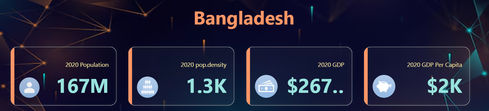
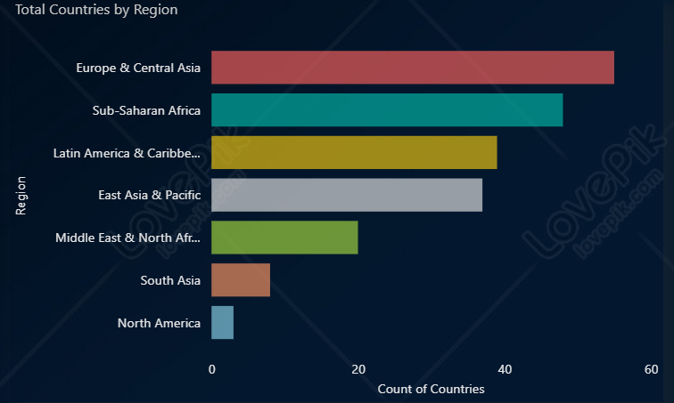
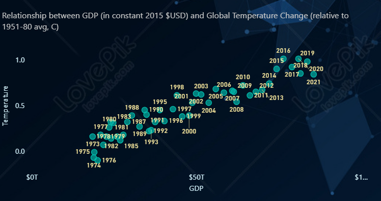
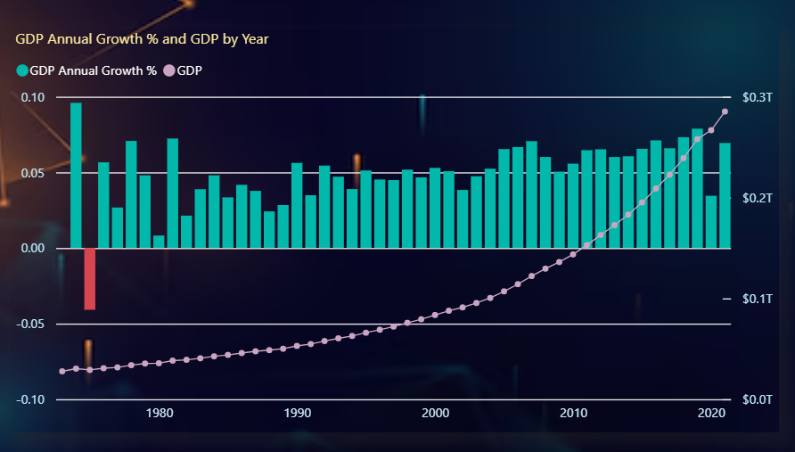
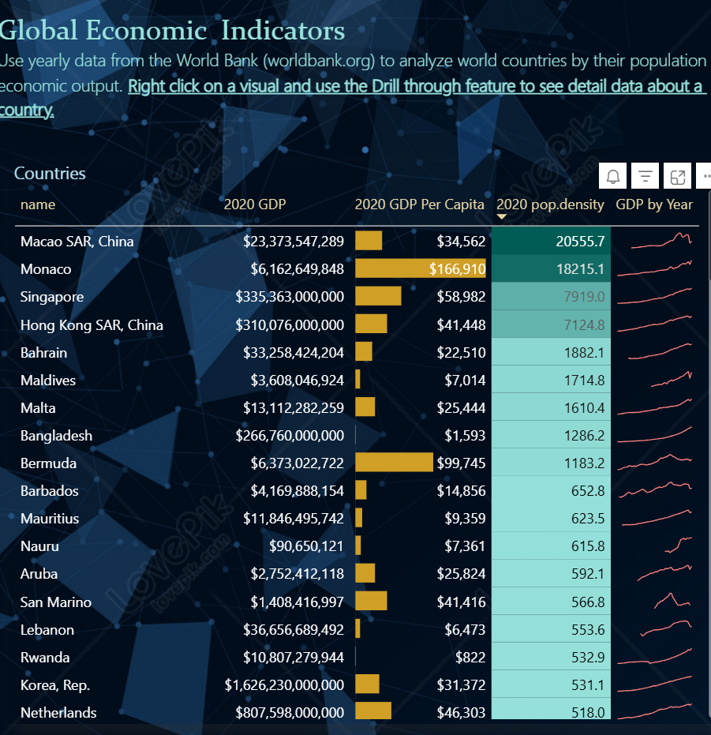

# 🌍 Global Population, GDP, and Climate Dashboard

This Power BI project presents an interactive and insightful dashboard exploring **global economic and environmental indicators** across countries and regions. It visualizes trends in **GDP, Population, Population Density, GDP per Capita, and Climate Change** using official data from the World Bank and NASA.

## 📌 Project Description

In this dashboard, we analyze how countries compare in terms of economic output and population distribution and how these relate to **climate change trends over time**. By combining GDP and population indicators with global temperature data, this project provides a comprehensive perspective on development, disparity, and sustainability.

---

## 📈 Key Features & Insights

- 📊 **Country-Level KPIs**: Drill down into 2020 data such as:
  - Population  
  - Population Density  
  - GDP  
  - GDP per Capita  

  

- 🌍 **Country Count by Region**:
  Shows the distribution of countries across global regions.

  

- 🌡️ **GDP vs Temperature Scatter**:
  Illustrates the correlation between economic growth and global temperature anomalies from 1970–2021.

  

- 📉 **GDP & Growth Over Time**:
  A stacked bar and line chart showing GDP values and their annual growth rates over the decades.

  

- 🧾 **Detailed Global Table**:
  An interactive matrix of countries showing GDP, GDP per capita, and population density with drill-through capability.

  

---

## 🧠 Insights Summary

- **Europe & Central Asia** has the most countries listed.
- **Monaco** tops the chart in GDP per capita, followed by **Singapore** and **Hong Kong**.
- The **global GDP trend** shows steady growth since the 1980s, while **global temperatures** have also risen in parallel.
- Countries with **high GDP per capita** often have **high population density**, showing economic concentration.

---

## 📂 Data Sources

- 🌐 **World Bank** Open Data:
  - [`countries.json`](./countries.json)
  - [`countries-indicators.csv`](./countries-indicators.csv)
- 🔬 **NASA Global Temperature** Data:
  - [`nasa-global-temp-data.csv`](./nasa-global-temp-data.csv)
- 🗺️ **GeoJSON for world map**:
  - [`world-countries-geomap.json`](./world-countries-geomap.json)

---

## 🛠️ Tools & Technologies

- Microsoft **Power BI**
- Data Cleaning with **Power Query**
- Data from **World Bank**, **NASA**, and **GeoJSON**
- Visuals include: Card KPIs, Matrix Tables, Stacked Bars, Line Charts, and Scatter Plots

---

## 🚀 How to Use

1. Download or clone this repository.
2. Open the `.pbix` file in Power BI Desktop.
3. Use interactive filters, drill-throughs, and visuals to explore the data.
4. Customize or publish to Power BI service as needed.

---

## 👤 Author

**Maradani Ratnakarun**  
Final Year B.Tech IT Student | Data Analyst | Power BI Enthusiast  
[LinkedIn](https://www.linkedin.com/in/maradani-ratnakarun-783534331/) | [GitHub](https://github.com/Maradani-Ratnakarun)

---

## 📄 License

This project is open-source and available under the [MIT License](LICENSE).

